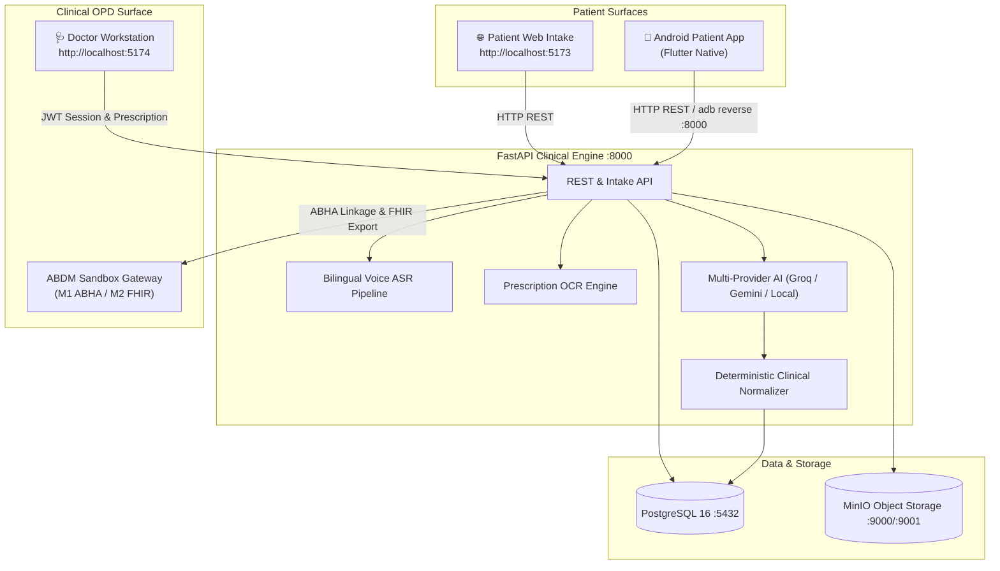

# 🌿 SwasthyaSaathi (स्वास्थ्य साथी)
### *Intelligent Pre-Consultation Clinical Intake & Decision Support System for AYUSH Healthcare*

[](https://fastapi.tiangolo.com)
[](https://flutter.dev)
[](https://react.dev)
[](https://www.typescriptlang.org)
[](https://www.postgresql.org)
[](https://abdm.gov.in)
[](LICENSE)

> **Clinical Governance Mandate:**  
> **"AI ASSISTS. PHYSICIAN DECIDES."**  
> SwasthyaSaathi is an assistive pre-consultation intake tool. It captures symptoms, voice narratives, constitutional AYUSH markers, and paper prescriptions **before** the consultation. It does not perform autonomous diagnosis or drug prescribing; all outputs are delivered to the registered AYUSH physician as structured draft findings.

---

## 🌐 Quick Access & Port Reference

When running SwasthyaSaathi locally, the services are available at the following URLs:

| Service | Port / URL | Description | Default Credentials |
|---|---|---|---|
| **Patient Web Intake Portal** | **`http://localhost:5173`** | Multilingual patient self-service intake, voice case taking, document upload, and OPD token tracking | *Public (No login required)* |
| **Doctor Clinical Workstation** | **`http://localhost:5174`** | OPD live queue, triage priority list, AI draft review, transcript audio player, and prescription formulation | **Username:** `dr.ayush`<br>**Password:** `demo_password123` |
| **FastAPI Backend & Swagger** | **`http://localhost:8000/docs`** | Interactive OpenAPI / Swagger documentation and health endpoints | *Bearer JWT (via Doctor Login)* |
| **MinIO Object Storage** | **`http://localhost:9001`** | Web console for inspecting uploaded prescription scans and audio files | **User:** `swasthya_minio`<br>**Password:** `swasthya_minio_secret` |
| **Android Patient App** | Physical Device / Emulator | Native Flutter mobile app with hardware microphone, camera OCR viewfinder, and offline sync | Connected via ADB |

---

## 🏛 System Architecture



---

## 🚀 Quick Start Guide

### 1. Prerequisites
- **Node.js** 18+ and **npm**
- **Python** 3.11+
- **Docker & Docker Compose** (for PostgreSQL and MinIO)
- *(Optional)* **Flutter SDK** 3.13+ (for Android mobile development)

---

### 2. Clone & Configure Environment
```bash
git clone https://github.com/harshkoli1255/Swasthya-Saathi.git
cd Swasthya-Saathi

# Create environment configuration files
cp .env.example .env
cp backend/.env.example backend/.env
```

---

### 3. Start Infrastructure (PostgreSQL & MinIO)
```bash
docker compose up -d db minio
```

---

### 4. Setup & Start Backend (Port 8000)
```bash
cd backend

# Create & activate python virtual environment
python3 -m venv venv
source venv/bin/activate

# Install dependencies
pip install -e ".[dev]"

# Run database migrations
alembic upgrade head

# Seed default doctors and demo OPD queue
python scripts/seed.py             # Creates dr.ayush, dr.sharma, admin
python scripts/seed_questions.py   # Seeds intake questionnaire bank
python scripts/seed_encounters.py  # Generates synthetic queue & patient intake tokens

# Start FastAPI server
uvicorn app.main:app --host 0.0.0.0 --port 8000 --reload
```
- Interactive Swagger API Documentation: **`http://localhost:8000/docs`**
- Health check: **`http://localhost:8000/api/v1/health`**

---

### 5. Start Web Portals (Patient :5173 & Doctor :5174)
Open a new terminal window:
```bash
cd web
npm install

# Start both web surfaces concurrently with one command
npm run dev
```

This single command launches both independent web portals:
- 🌐 **Patient Intake Web Portal**: **`http://localhost:5173`**
  - Walk through patient self-onboarding, bilingual complaint voice recording, and OPD token generation.
- 🩺 **Doctor Clinical Workstation**: **`http://localhost:5174`**
  - Login with:
    - **Username:** `dr.ayush`
    - **Password:** `demo_password123`
  - Review live triage queue, inspect AI draft summaries, and issue validated prescriptions.

*(Alternatively, you can run them individually using `npm run dev:patient` or `npm run dev:doctor`).*

---

### 6. Run the Android Patient App (Optional)
Open a new terminal window:
```bash
cd mobile
flutter pub get

# If testing on a physical Android device connected via USB:
adb reverse tcp:8000 tcp:8000

# Run on your connected device or emulator:
flutter run
```
> For complete mobile architecture, design tokens, and canonical 26-screen mapping, refer to the [Mobile README](mobile/README.md).

---

## 🔑 Key Features

- **Dual Dedicated Web Surfaces**:
  - `http://localhost:5173`: Clean, high-contrast, patient-facing intake portal designed for kiosks and personal browsers.
  - `http://localhost:5174`: Specialized high-density doctor workstation adhering to the Forest Sage clinical theme.
- **Bilingual Voice Intake**: Hindi & English conversational symptom capture with real-time waveform and editable transcript.
- **AYUSH Prakriti Questionnaire**: Constitutional assessment (Agni, Nidra, Satmya, Koshtha) aligned with classical clinical practice.
- **Prescription OCR Scanner**: Optical scanner with laser viewfinder, extracted medicine validation, and multi-page support.
- **Live OPD Queue Tokens**: Boarding-pass styled queue status with dynamic wait-time estimation.
- **ABDM Milestones 1 & 2**: ABHA ID verification, OTP handshake, and FHIR R4 clinical summary export.
- **Multi-Provider AI with Zero-Cloud Fallback**: Groq Cloud (`qwen/qwen3.6-27b`), Google Gemini 1.5, local Ollama, or deterministic regex engine (100% offline safety).

---

## 🤖 Configuring AI Providers (Optional)

Configure your preferred LLM provider in `backend/.env`:

```env
# Option A: Groq Cloud (Recommended — Free & Sub-Second Latency)
AI_PRIMARY_PROVIDER=groq
GROQ_API_KEY=gsk_your_groq_api_key_here
GROQ_MODEL=qwen/qwen3.6-27b
FEATURE_CLOUD_AI_FALLBACK=true

# Option B: Google Gemini
AI_PRIMARY_PROVIDER=gemini
GEMINI_API_KEY=your_gemini_key_here
GEMINI_MODEL=gemini-1.5-flash

# Option C: Local Ollama (Completely Offline)
AI_PRIMARY_PROVIDER=ollama
OLLAMA_BASE_URL=http://localhost:11434
OLLAMA_MODEL=llama3.1:8b
```
*If no API key is provided, the backend seamlessly falls back to its deterministic rule engine with zero downtime.*

---

## 🧪 Testing & Verification

### Backend Automated Test Suite
```bash
cd backend
pytest -v tests/
```
*(55/55 unit and integration tests passing)*

### Web Portals Linting & Build
```bash
cd web
npm run lint
npm run build
```

### Mobile Flutter Analysis & Tests
```bash
cd mobile
flutter analyze  # 0 issues found
flutter test     # 9/9 tests passing
```

---

## 📁 Repository Structure

```text
Patient-Case-Taking-Software/
├── backend/                  # FastAPI intelligence engine & ABDM integration
│   ├── app/
│   │   ├── api/v1/           # API routes (auth, intake, encounters, abdm, doctor)
│   │   ├── core/             # Database connection, security, configuration
│   │   ├── models/           # SQLAlchemy models
│   │   ├── schemas/          # Pydantic request/response schemas
│   │   └── services/         # LLM chains, ASR, OCR, FHIR generator
│   ├── scripts/              # Database seed scripts (seed.py, seed_encounters.py)
│   └── tests/                # Pytest unit & integration test suite
│
├── web/                      # React 18 + Vite Web Applications
│   ├── src/
│   │   ├── features/auth/    # Doctor authentication
│   │   ├── features/doctor/  # Consultation chart & encounter details
│   │   ├── features/queue/   # Live OPD triage queue
│   │   ├── features/intake/  # Patient intake flow (:5173)
│   │   └── features/public/  # Hospital landing page (:5173)
│   ├── vite.patient.config.ts# Patient Portal config (Port 5173)
│   ├── vite.doctor.config.ts # Doctor Workstation config (Port 5174)
│   └── scripts/dev-all.mjs   # Concurrent dual-surface dev launcher
│
├── mobile/                   # Flutter Android patient application
│   ├── lib/                  # Complete Flowstep 26-screen implementation
│   ├── test/                 # Widget & state machine test suite
│   └── README.md             # Dedicated mobile documentation & screen index
│
├── design/                   # Approved Flowstep UI/UX specifications
├── docker-compose.yml        # PostgreSQL 16 & MinIO object storage services
└── README.md                 # System overview & quickstart guide
```

---

## ⚖️ Clinical Safety & Governance Note

SwasthyaSaathi operates strictly within the framework of assistive medical technology:
1. **No Autonomous Clinical Decisions**: Clinical risk scores and provisional symptom extractions are presented as editable drafts.
2. **Physician Verification Required**: Prescriptions and diagnoses cannot be finalized without explicit authentication and sign-off by a licensed AYUSH practitioner.
3. **Tenant & Data Isolation**: Patient public intake tokens have restricted access and cannot inspect other encounters or clinical queues.

---

## 👥 Acknowledgements
Developed for the **Smart India Hackathon (SIH)** to transform high-volume outpatient case taking across AYUSH hospitals and dispensaries.
