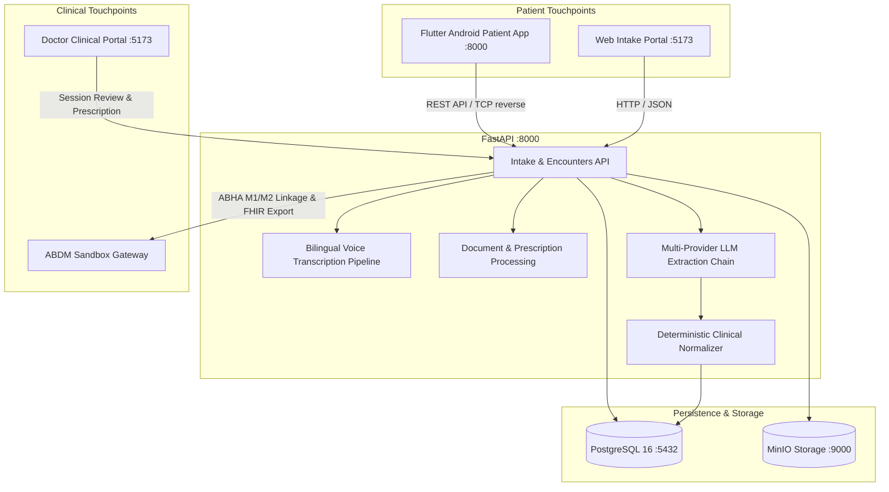

# 🌿 SwasthyaSaathi (स्वास्थ्य साथी)
### *Intelligent Pre-Consultation Clinical Intake & Decision Support System for AYUSH Healthcare*

[](https://fastapi.tiangolo.com)
[](https://flutter.dev)
[](https://react.dev)
[](https://www.typescriptlang.org)
[](https://www.postgresql.org)
[](https://abdm.gov.in)
[](LICENSE)

> **Clinical Governance Mandate:**  
> **"AI ASSISTS. PHYSICIAN DECIDES."**  
> SwasthyaSaathi is an assistive pre-consultation intake platform. It does not perform autonomous diagnosis, clinical triage decisions, or drug prescriptions. All captured symptoms and AI-extracted formulations are delivered to the registered AYUSH physician as structured draft findings pending direct clinical examination.

---

## 📑 Table of Contents
1. [System Overview & Architecture](#-system-overview--architecture)
2. [Key Subsystems](#-key-subsystems)
   - [Android Patient Mobile App (`/mobile`)](#1-android-patient-mobile-app-mobile)
   - [FastAPI Intelligence Backend (`/backend`)](#2-fastapi-clinical-backend-backend)
   - [Doctor Workstation Portal (`/web`)](#3-doctor-clinical-workstation-web)
3. [Canonical 26-Screen Patient Journey](#-canonical-26-screen-patient-mobile-journey)
4. [Quick Start (Docker — Recommended)](#-quick-start-with-docker-recommended)
5. [Running the Android Mobile App](#-running-the-flutter-android-patient-app)
6. [Running the Doctor Web Portal](#-running-the-doctor-web-portal)
7. [Configuring AI Intelligence (Groq / Gemini / Ollama)](#-configuring-ai-intelligence-providers)
8. [Testing & Quality Verification](#-testing--quality-verification)
9. [Project Directory Layout](#-project-directory-layout)
10. [Troubleshooting & FAQs](#-troubleshooting--faqs)

---

## 🏛 System Overview & Architecture

SwasthyaSaathi bridges the critical communication gap in high-volume AYUSH (Ayurveda, Yoga & Naturopathy, Unani, Siddha, Homeopathy) and Integrative Medicine OPD clinics. By capturing patient history, bilingual voice narratives, and paper prescriptions **before** the patient steps into the examination cabin, it synthesizes an evidence-grounded clinical draft for the physician.



---

## 📦 Key Subsystems

### 1. Android Patient Mobile App (`/mobile`)
- **Technology**: Built using **Flutter 3** with `flutter_riverpod` state management, `go_router` navigation, `record` audio streaming, and `dio` networking.
- **Design System**: Strict alignment with approved **Flowstep visual designs** (`AppTheme`):
  - Primary Saffron (`#EA580C`), Clinical Emerald (`#059669`), Dark Slate (`#090D16`), Surface (`#F8FAFC`).
  - Standardized `20dp` card radius, `16dp` interactive controls, and `56dp` minimum touch targets.
- **Key Modules**:
  - **ABDM Health ID (Step 1-3)**: 14-digit ABHA input, OTP validation, verified demographic profile linking.
  - **Voice Intake Engine**: Bilingual Hindi/English speech recording with real-time 21-bar acoustic waveform visualizer and editable transcription review.
  - **AYUSH Prakriti Questionnaire**: Constitutional profiling across Agni (digestion), Nidra (sleep quality), and Satmya (thermal adaptation).
  - **Prescription Scanner & OCR**: Optical viewfinder with laser detection line, extracted medication review, and multi-page carousel.
  - **Live OPD Queue Token**: Boarding-pass styled queue status with real-time patient-ahead computation, estimated wait times, and consultation progress stepper.
  - **System States**: Dedicated offline mode, privacy session lock (10-min inactivity), microphone permission fallbacks, and paper scanning empty states.

### 2. FastAPI Clinical Backend (`/backend`)
- **Technology**: Python 3.11+, **FastAPI**, SQLAlchemy 2.0 (Async), Alembic, Pydantic v2.
- **Multi-Provider AI Intelligence**:
  - Primary: High-speed **Groq Cloud** (`qwen/qwen3.6-27b`, `llama-3.1-8b-instant`).
  - Secondary Fallback: **Google Gemini 1.5 Flash**.
  - On-Premises Local Fallback: **Ollama** (`llama3.1:8b`).
  - Zero-Cloud Safety Fallback: Deterministic regex and clinical dictionary extraction engine ensuring 100% uptime with zero API keys.
- **Clinical Safety & Authorization**:
  - Patient tenant isolation: public intake tokens cannot query doctor queues or cross-examine other encounters.
  - ABDM Milestones 1 & 2 integration with RSA-OAEP encryption and mock sandbox adapter.
  - Full FHIR R4 export mapper for clinical summaries.

### 3. Doctor Clinical Workstation (`/web`)
- **Technology**: React 18, TypeScript, Vite, TanStack Query, Forest Sage Clinical Design System.
- **Features**: Real-time triage priority list (Emergency / Urgent / Routine), dual-column consultation chart, verified AI draft summary review, raw transcript audio playback, document viewer, and prescription writing.

---

## 📱 Canonical 26-Screen Patient Mobile Journey

| Screen # | State / Milestone | Description & Flowstep Alignment |
|---|---|---|
| **01** | **Welcome & Language Entry** | High-contrast hero, 56dp CTA buttons, hospital branding, trust strip |
| **02** | **Language Selector Sheet** | 32dp rounded modal bottom sheet with native script language cards (`English`, `हिन्दी`, `मराठी`, `ગુજરાતી`) |
| **03** | **ABHA ID Input (Step 1)** | 14-digit ABHA ID entry with ABDM Mock Sandbox environment indicator |
| **04** | **ABHA OTP Verification (Step 2)** | 6-box OTP entry, 60s countdown timer, and secure verification |
| **05** | **Verified ABHA Profile (Step 3)** | Verified demographic card, linked hospital records, and ABDM Linked badge |
| **06** | **Patient Consent Notice** | Granular data switches (Voice, OCR, AYUSH markers) and clinical governance notice |
| **07** | **Voice Intake (Chief Complaint)** | High-contrast symptom prompt with quick symptom selection chips |
| **08** | **Voice Recording Listening** | 21-bar pulsating acoustic waveform, active timer, and live voice listening |
| **09** | **Voice Processing State** | Saffron circular spinner with multi-phase intake structuring checklist |
| **10** | **Transcript Review & Edit** | Bilingual transcription edit container with character counter |
| **11** | **Adaptive Clinical Follow-up** | Dynamic follow-up questions (`Does burning happen immediately after meals?`) |
| **12** | **AYUSH Prakriti Intake** | Constitutional selectors: Agni (Digestion), Nidra (Sleep), Satmya (Season) |
| **13** | **Document Scanner Viewfinder** | Architectural camera viewfinder with laser corner brackets and shutter control |
| **14** | **Document OCR Processing** | Animated laser sweep line and extracted medication overlay chips |
| **15** | **Extracted Document Review** | Prescribing clinic card, identified AYUSH medicines, and doctor cross-exam notice |
| **16** | **Clinical Case Review Summary** | Pre-consultation summary card with physician examination disclosure |
| **17** | **OPD Token & Live Queue** | Dark boarding pass card (`OPD • A42`), queue position, wait time, doctor card, and consultation progress stepper |
| **18** | **Network Offline State** | Amber banner, cached local token, hospital Wi-Fi reconnect CTA |
| **19** | **Session Inactivity / Lock State** | Privacy lock modal triggering after 10 minutes of inactivity |
| **20** | **Microphone Permission Denied** | Android permission instructions and seamless switch to text typing mode |
| **21** | **Document Processing Failure** | Error banner, blurry scan tips, and retry capture action |
| **22** | **Camera Unavailable State** | Camera hardware failure fallback to gallery photo picker |
| **23** | **Multi-page Document Carousel** | Multi-document carousel (`P1: Prescription`, `P2: Lab Report`) with add page CTA |
| **24** | **Empty Health Records State** | First-visit guidance and paper prescription scanner CTA |
| **25** | **Exit Confirmation Sheet** | Pause symptom intake sheet with draft preservation |
| **26** | **Dispensary Token Reference** | Post-consultation pharmacy token (`PHARMACY • P18`), stock status, and medicine checklist |

---

## 🚀 Quick Start with Docker (Recommended)

### Step 1: Clone the Repository
```bash
git clone https://github.com/harshkoli1255/Swasthya-Saathi.git
cd Swasthya-Saathi
```

### Step 2: Environment Setup
```bash
cp .env.example .env
cp backend/.env.example backend/.env
```

### Step 3: Launch PostgreSQL & MinIO
```bash
docker compose up -d db minio
# Or: make up
```

### Step 4: Run Migrations & Seed Data
```bash
cd backend
# With your python environment active:
alembic upgrade head
python scripts/seed.py             # Creates default doctor: dr.ayush / demo_password123
python scripts/seed_questions.py   # Seeds AYUSH & general intake question bank
python scripts/seed_encounters.py  # Seeds sample patient OPD queue
cd ..
```

### Step 5: Start FastAPI Backend
```bash
cd backend
uvicorn app.main:app --host 0.0.0.0 --port 8000 --reload
```
- API Docs (Swagger UI): `http://localhost:8000/docs`
- Health Endpoint: `http://localhost:8000/api/v1/health`

---

## 📱 Running the Flutter Android Patient App

### Prerequisites
- Flutter SDK `3.13.2+`
- Android Studio / Android SDK (API 34+)
- Connected Android Device (USB / Wireless ADB) or Android Emulator

### Step 1: Install Dependencies
```bash
cd mobile
flutter pub get
```

### Step 2: Bridge Device Network (Physical Devices)
If testing on a physical Android phone connected via USB or wireless ADB:
```bash
adb reverse tcp:8000 tcp:8000
```
*(This allows the Android app to connect directly to your local FastAPI backend at `http://127.0.0.1:8000`).*

### Step 3: Build and Run
```bash
# Run on connected device in debug mode
flutter run

# Or build native release/debug APK:
flutter build apk --debug --target-platform android-arm64
adb install -r build/app/outputs/flutter-apk/app-debug.apk
```

---

## 💻 Running the Doctor Web Portal

```bash
cd web
npm install
npm run dev
```
Visit **`http://localhost:5173`** in your browser.
- **Doctor Login:** `http://localhost:5173/doctor/login`
  - **Username:** `dr.ayush`
  - **Password:** `demo_password123`

---

## 🤖 Configuring AI Intelligence Providers

In `backend/.env`, configure your preferred intelligence engine:

### Option A: Groq Cloud (Recommended — Free & Sub-Second Latency)
```env
AI_PRIMARY_PROVIDER=groq
GROQ_API_KEY=gsk_your_groq_api_key_here
GROQ_MODEL=qwen/qwen3.6-27b
FEATURE_CLOUD_AI_FALLBACK=true
```

### Option B: Google Gemini
```env
AI_PRIMARY_PROVIDER=gemini
GEMINI_API_KEY=your_gemini_api_key_here
GEMINI_MODEL=gemini-1.5-flash
FEATURE_CLOUD_AI_FALLBACK=true
```

### Option C: Local Offline AI with Ollama
```env
AI_PRIMARY_PROVIDER=ollama
OLLAMA_BASE_URL=http://localhost:11434
OLLAMA_MODEL=llama3.1:8b
```

---

## 🧪 Testing & Quality Verification

### 1. Mobile Flutter Test Suite & Static Analysis
```bash
cd mobile
flutter analyze  # 0 issues found (0 errors, 0 warnings, 0 hints)
flutter test     # 9/9 tests passed (100% pass rate)
```

### 2. Backend Pytest Suite
```bash
docker exec swasthya_backend pytest -v tests/
# 55/55 passed (100% pass rate)
```

---

## 📁 Project Directory Layout

```text
Patient-Case-Taking-Software/
├── backend/
│   ├── alembic/                # Database migrations (PostgreSQL/SQLite)
│   ├── app/
│   │   ├── api/v1/             # Endpoints (auth, intake, abdm, doctor, encounters)
│   │   ├── core/               # Database engine, config, security & rate limiting
│   │   ├── models/             # SQLAlchemy ORM clinical models
│   │   ├── schemas/            # Pydantic validation schemas
│   │   └── services/           # LLM chains, Whisper ASR, OCR, Safety normalizers
│   ├── scripts/                # Database seeders (seed.py, seed_encounters.py)
│   ├── tests/                  # Pytest test suite (55 automated tests)
│   └── Dockerfile              # Backend container definition
│
├── mobile/                     # Flutter Android Patient Application
│   ├── lib/
│   │   ├── core/
│   │   │   ├── models/         # JSON data models for intake & ABDM
│   │   │   ├── network/        # Dio client, interceptors, session manager
│   │   │   ├── router/         # GoRouter path definitions (all 26 screens)
│   │   │   └── theme/          # AppTheme, Flowstep colors, typography, radii
│   │   ├── features/
│   │   │   ├── onboarding/     # Screen 01 Welcome
│   │   │   ├── identity/       # Screens 03-05 ABHA ID, OTP, Profile
│   │   │   ├── consent/        # Screen 06 Patient Data Privacy Notice
│   │   │   ├── interview/      # Screens 07-12 Voice, Transcript, Prakriti
│   │   │   ├── documents/      # Screens 13-15, 21, 23 Scanner, OCR, Multipage
│   │   │   ├── review/         # Screen 16 Clinical Case Review Summary
│   │   │   ├── completion/     # Screens 17 & 26 Live OPD Queue Token & Pharmacy
│   │   │   └── system/         # Screens 18-20, 22, 24, 25 Offline, Lock, Errors
│   │   └── shared/widgets/     # AppHeader, StatusBadge, AppButton, ChoiceCard
│   └── test/                   # Flutter unit & widget test suite
│
├── web/                        # React 18 TypeScript Doctor Clinical Portal
│   ├── src/
│   │   ├── features/           # Doctor Login, OPD Queue, Encounter Chart
│   │   ├── components/         # Design system components
│   │   └── api/                # Axios API client
│   └── vite.config.ts          # Vite build configuration
│
├── design/                     # Approved Flowstep Visual Source of Truth
│   └── patient_mobile_app/     # Screen JSX code & design references
├── docker-compose.yml          # PostgreSQL 16, MinIO, Backend orchestration
├── Makefile                    # CLI shortcuts (make up, make test, etc.)
└── README.md                   # Project documentation
```

---

## ❓ Troubleshooting & FAQs

### 1. `SocketException: Connection refused` on Android device
- **Cause**: The Android device cannot reach `http://127.0.0.1:8000` because `127.0.0.1` refers to the mobile phone itself.
- **Solution**: Run `adb reverse tcp:8000 tcp:8000` to route phone port 8000 to your host machine's port 8000. For Android Emulator, use `http://10.0.2.2:8000`.

### 2. `Microphone Permission Denied` on Android 14/15/16
- **Solution**: The app automatically shows Screen 20 (`MicrophonePermissionDeniedScreen`) with step-by-step guidance to enable audio permissions in Android Settings, or allows immediate one-tap transition to text typing mode.

### 3. `alembic: command not found`
- **Solution**: Activate your virtual environment first (`source backend/venv/bin/activate` or `source .venv/bin/activate`) and run `pip install -e ".[dev]"`.

---

## 👥 Contributors & Acknowledgements
Built for the **Smart India Hackathon (SIH)** — Transforming pre-consultation OPD efficiency across AYUSH Healthcare Institutions through safe, assistive clinical intelligence.
